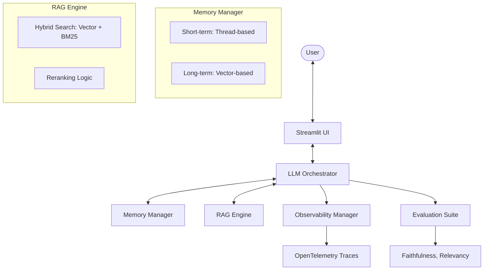

# Scalable Agentic AI Framework (Agentic OS)

A production-grade, scalable framework for building and orchestrating enterprise-level GTM (Go-To-Market) Agents. This repository transforms the framework into a comprehensive "Agentic OS" with robust memory management, RAG capabilities, and observability.

## 🏗️ Technical Architecture



## 🚀 Key Features

### 1. Advanced Memory Management (Memory OS)
- **Short-term Memory:** Thread-safe, chronological conversation tracking for contextual continuity.
- **Long-term Memory:** Persistent storage of historical interactions and user preferences using vector stores (ChromaDB/Pinecone).
- **Strategy Pattern:** Easily swap memory backends based on enterprise requirements.

### 2. Production-Grade RAG Engine
- **Hybrid Search:** Combines semantic vector search with keyword-based BM25 search for maximum retrieval precision.
- **Reranking:** Integrated reranking logic to ensure the most relevant context is prioritized for the LLM.
- **Scalable Architecture:** Designed to handle massive document corpora with optimized retrieval.

### 3. Comprehensive Evaluation Suite
- **Metrics:** Built-in support for Faithfulness and Answer Relevancy (inspired by Ragas).
- **Batch Evaluation:** Tools for systematic testing of agent performance across large datasets.
- **Quality Assurance:** Ensures agent responses remain grounded and accurate over time.

### 4. Enterprise Observability
- **LLM Tracing:** Deep visibility into LLM calls, latency, and costs using OpenTelemetry.
- **Monitoring:** Integrated logging with `loguru` and span-based tracing for debugging complex agentic workflows.
- **Status Tracking:** Granular success/failure monitoring for all critical agent operations.

### 5. Professional Streamlit Interface
- **Chat Experience:** Modern, responsive UI for interacting with GTM Agents.
- **Configurable Parameters:** Real-time adjustment of RAG weights and memory settings.
- **Session Management:** Robust handling of multiple conversation threads.

## 🛠️ Getting Started

### Installation
```bash
pip install -r requirements.txt
```

### Running the UI
```bash
streamlit run app/streamlit_ui.py
```

## 🛡️ Design Principles
- **Design Patterns:** Extensive use of Factory, Strategy, and Singleton patterns for modularity and scalability.
- **Type Safety:** 100% Type Hints and Pydantic models for robust data validation.
- **Error Handling:** Comprehensive try-except blocks with detailed logging.
- **Documentation:** Detailed docstrings following Google/NumPy style.

## 📊 Observability
This framework uses OpenTelemetry for distributed tracing. Traces are exported to the console by default and can be easily configured to export to Jaeger, Honeycomb, or AWS X-Ray.

---
© 2026 Agentic OS Team. Built for the Enterprise.
